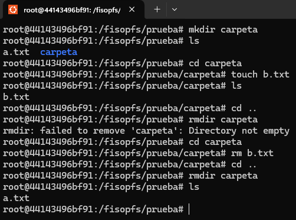

# fisop-fs

## Decisiones del diseño

### Estructuras en memoria

1. **Inodos**
- `type`: El tipo de un inodo puede ser archivo (REGULAR) o directorio (DIRECTORY).
- `mode`: Permisos del inodo.
- `size`: Tamaño del contenido del inodo en bytes.
- `uid`: ID del usuario del inodo.
- `gid`: ID del grupo del usuario del inodo.
- `last_access`: Tiempo del último acceso.
- `last_modification`: Tiempo de la última modificación.
- `creation_time`: Tiempo de la creación del inodo.
- `path`: Ruta asociada al inodo.
- `content`: Buffer de bytes que representa el contenido del inodo.
- `directory_path`: Ruta del directorio padre.

2. **Superbloque**
- `inodes`: Arreglo de inodos.
- `inodes_states`: Arreglo que indica si un inodo está libre u ocupado.

## Respuestas

## ¿Cómo el sistema de archivos encuentra un archivo específico dado un path?

Para encontrar un archivo, se hace una búsqueda de su índice en el arreglo de inodos
del superbloque, invocando a la función `get_inode_index`.

Se descartan paths vacíos o nulos, para luego extraer el nombre del archivo del path,
y comparar con todos los inodos del arreglo hasta encontrarlo. En caso de error,
se retorna -1.

Cabe destacar que el inodo raíz (`/`) se encuentra siempre en el índice 0.

## Serialización del sistema de archivos en disco

Para persistir los datos del file system, se usa un archivo especial (llamado `filedisk`),
de extensión `.fisopfs`, que puede ser determinado por el usuario del programa, o usar el
archivo de persistencia provisto por defecto (`fs.fisopfs`).

Al iniciar el programa, se leen los datos de este archivo, si es que existiera, y se cargan
las estructuras persistidas. De no existir, se crea y se inicializa. Ante un `fisopfs_destroy`
o `fisopfs_flush`, los datos estarían asegurados, persistidos en el filedisk.

## Casos de prueba

En la carpeta `capturas` se encuentras las capturas de pruebas realizadas al file system. Todas
fueron corridas levantando el sistema con docker, usando las instrucciones del makefile provisto.

### Prueba umount

### Prueba de creación

### Prueba ls

### Prueba cat

### Prueba touch

### Prueba cat anidados

### Prueba stat

### Prueba rm y rmdir

### Prueba truncate y truncate con contenido previo

Nota: El tiempo está adelantado en la terminal

### Prueba mkdir

### Prueba tiempos

### Prueba unlink

### Prueba persistencia

### Prueba filedisk

### Prueba append

Nota: Esta prueba fue realizada en otra terminal con otro filedisk

### Prueba cd inválido

Nota: Esta prueba fue realizada en otra terminal con otro filedisk

